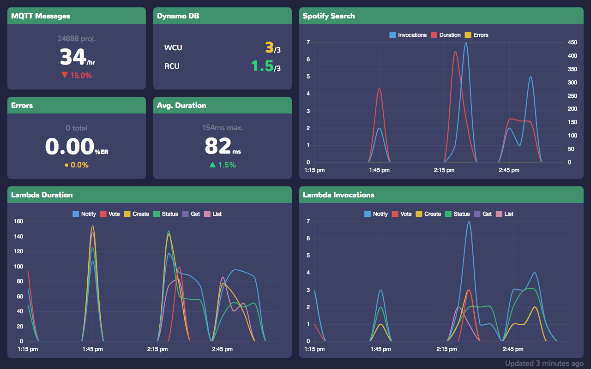

# Vue CloudWatch Dashboard



This project facilitates live monitoring CloudWatch metrics. All desired metrics are specified in JSON format.

PWA functionality allows the app to be cached on a mobile device after it's been served via `npm run serve` command.

A major problem with accessing CloudWatch metrics data is that metrics are often only reported when an event occurs. This results in data with many missing datapoints. The server-side Lambda function included in the project pads data with zero values whenever it is found to be missing.

The period, backfill time, and refresh interval are all configurable. They have been set with reasonable values of five minutes, five minutes, and two hours, respectively. Please note that AWS promises that CloudWatch metrics will be populated with a latency of at most ten minutes.

The charting capabilities of this project are limited in favor of a simple means of interacting with CloudWatch metrics data. More charting functionality may be added at a later date.

This project's aesthetic was heavily inspired by [Vuepoint](https://github.com/ashtonmeuser/vuepoint).

## Commands

First, clone the repo. Run `npm install` to install dependencies. Ensure the rest of the  setup is complete. The steps to setup are as follows.

* Create a `metrics.json` file appropriate to the metrics you'd like to pull from CloudWatch.
* Create `.env.{NODE_ENV}` file(s) appropriate to the way(s) in which you intend to build the web application. A `.env.development` file and `.env.production` file are recommended.
* The lambda function uploaded to AWS. You can simply use the included [archive](server/archive.zip).
* An API properly set up using API Gateway. See the *Lambda Function* section for more details.

To build for development including hot reload, run the following.

```bash
# build for development
npm run dev
```

To fully optimize the web application, run the following. This bundles the application into a `dist` directory. The production build also includes PWA support, which allows the web application to be cahced on a mobile device. Once the application is being served, access it on a mobile device and save it to your homescreen. The server can now be taken down as the application is cached and fully functional on your device.

```bash
# build for production
npm run build

# serve the bundled dist folder in production mode
npm run serve
```

## Credentials

The app expects there to be a `.env.{NODE_ENV}` file in the following format:

```
API_ENDPOINT={YOUR_API_ENDPOINT}
API_KEY={YOUR_API_KEY}
```

Replace `NODE_ENV` with `development`, `test`, or `production`. These will be loaded when built for the respective environments and used to interact with your API. See the next section for setting up an endpoint using AWS Gateway and Lambda.

## Lambda Function

An AWS Lambda function can be used to serve properly formatted metrics to the CloudWatch Dashboard. Please see the [server](server) directory. To deploy, upload the [archive](server/archive.zip) to a Lambda function either via the AWS CLI or the web interface. If you make changes to the server-side logic, make sure you recreate and reupload the archive. 

Create an endpoint using AWS API Gateway and properly secure it with an API key or other security measure. After creating your API endpoint, add a POST method and select the lambda function you just created. Enable *Use Lambda Proxy integration*. Next, enable CORS via the action dropdown menu. If using an API key (recommended), create a usage plan. This will prompt you to create an API key and select an API. Name your key and select the API you just created. Note the endpoint URL and the API you created. These should be entered into the `.env.{NODE_ENV}` file.

Please note that AWS charges for accessing CloudWatch metrics, so securing your endpoint should be a priority. This should also influence the refresh rate you choose. CloudWatch pricing information can be found [here](https://aws.amazon.com/cloudwatch/pricing/).

## AWS IAM Permissions

The Lambda function must have access to the `cloudwatch:GetMetricData` permission. Create a role in IAM to allow Lambda to access the correct resources.
